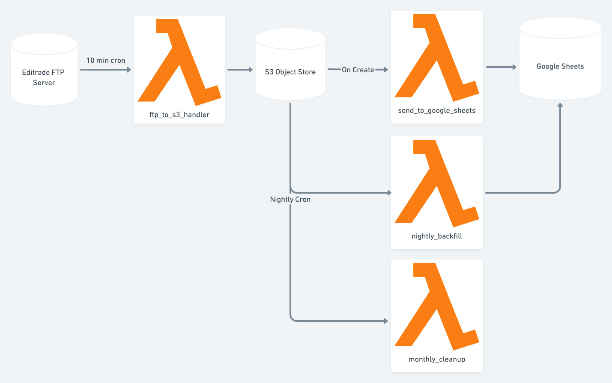

# Lambda: FTP to Google Sheet Transform pipeline

This is a small "pipeline" I wrote to help sync files from an external editrade ftp server to a private google sheet for ease of consumption.

While I personally am not in the shipping business I set this up to help a local business. If you need some help with something
similar let me know. I may be able to whip something up.

While I've cleaned up some of this code and added docs for my own sanity in the event I need to add to this years down the line,
this is not meant to be a business or really directly used for others. I'm putting this up on github just to share a fun pipeline
style example of lambda functions and to help me manage this code in the future.

## What does it do?
High level, this is a collection of scripts that do three core things:

1. Periodically check if new files are available on our FTP service. If so, upload them to an S3 bucket.
1. Any time a file is added to an S3 bucket, parse the details we care about and store / update a row in a google sheet.
    - We also run a backfill every night just in case there were errors / race conditions for eventual consistency.
1. On a nightly basis, clean up all files older than 30 days, and are in s3, from the ftp server.

Some other quality of life functions include
- The ability to force create / share a given sheet
- The ability to replay the all files in S3 from the last X days

Best part: It's going to be free for a long while with the current load. That was also a goal. Use some cheap tools that
can be put on a shelf and not need much oversight.

### Visual Overview

> Built with whimsical

### What are some things I'd add / change
- Really this project is missing a number of tests. Integration tests would be great.
- A bit better error handling. There some rudimentary stuff including exponential backoffs but it could be better.
- Better logging.
- A script to scaffold the parameter store. Mostly didn't add since I'm not planning to use this in multiple AWS accounts
- Potentially using google cloud so there are fewer things to integrate with. I'm more familiar with aws so I went with that.
- Make it faster. I did have a parallel upload feature. Unfortunately, this FTP server limits me to one connection per user and an [active FTP connection can only transfer one file at a time per the RFC.](https://stackoverflow.com/a/13195869) 
- Automated Graphs. Right now I have super basic monitoring via cloudwatch + serverless's site. Not horrible, but could be better.
- Better services / classes. This truly is like a bag of scripts. It works since I am effectively just running them on a cron. Could be better and may help me test better in the future.

## Local Setup
```bash
make # Will install pyenv and make a virtual env
make ensure_env_file
```

## Account configuration
* To deploy / run this application we require AWS credentials and a Google Cloud account
    * AWS is used for S3 storage, lambdas (serverless functions), secret management, and basic alerting
    * Google Cloud is used for the google sheets API
    * Optionally, a serverless account is also useful for additional monitoring purposes. If you choose to use a serverless account be sure to update `serverless.yml`'s `org` and `app` keys
    
### AWS
* [aws credentials configured for serverless documentation](https://serverless.com/framework/docs/providers/aws/guide/credentials/)

### Google Cloud
* [Google cloud service account json generation](https://cloud.google.com/iam/docs/creating-managing-service-accounts)
    * This JSON will be imported through `GOOGLE_SERVICE_ACCOUNT_CREDENTIAL_JSON` env variable
    * *You will need to enable the Sheets and Drive APIs*

### Sentry (optional)
* Sign up for a sentry account and make a lambda project. Copy the DSN.
* Note that based on the current `settings.py` set up this is only able to be enabled in "prod" (When `USE_PARAMETER_STORE` is true)
## Deployment
* You will also need to have [aws credentials configured for serverless](https://serverless.com/framework/docs/providers/aws/guide/credentials/)

### AWS Parameter Store
> We use the aws parameter store for easy cheap secret management.  
* Log into the aws console and navigate to [Parameter Store (systems manager)](https://console.aws.amazon.com/systems-manager/parameters?region=us-east-1)
* These should all be `SecureString` variables
* Create Three Variables
    * `EDITRADE_FTP_USERNAME`
    * `EDITRADE_FTP_PASSWORD`
    * `GOOGLE_SERVICE_ACCOUNT_CREDENTIAL_JSON` (Made during the credential step above)
    * `SENTRY_DSN`
* You could also use these parameters in development by setting the `USE_PARAMETER_STORE` environment variable to true

## Misc

### Sheet set up / sharing

The script / lambda will automatically create a worksheet but it will be inaccessible by anyone other than the service account. 
To remedy this we have a script to help automate sharing the sheet.

```bash
python -m management.create_and_share_sheet --role writer --share_with_email EMAIL_OF_INTEREST@gmail.com
```

### Helpful one liners
- Export `.env` variables to local shell
    ```bash
    export $(egrep -v '^#' .env | xargs)  
    ```

- Run backfill from s3 to sheets for the last day
    ```bash
    python -c 'import handlers; handlers.handler_bulk_parse_xml_files({ "days_back": 1 }, {})'
    ```
- Reimport files from the ftp to s3 for the last day
    ```bash
    python -c 'import handlers; handlers.handler_transfer_editrade_files_to_s3({ "days_back": 1 }, {})'
    ```
- Delete all files from the ftp server that are older than 30 days and exist in s3
    ```bash
    python -c 'import handlers; handlers.handler_delete_old_files({ "days_back": 30, "dry_run": "false" }, {})'
    ```

## Notable Mentions
* [Transfer File From FTP Server to AWS S3 Bucket Using Python](https://medium.com/better-programming/transfer-file-from-ftp-server-to-a-s3-bucket-using-python-7f9e51f44e35)
